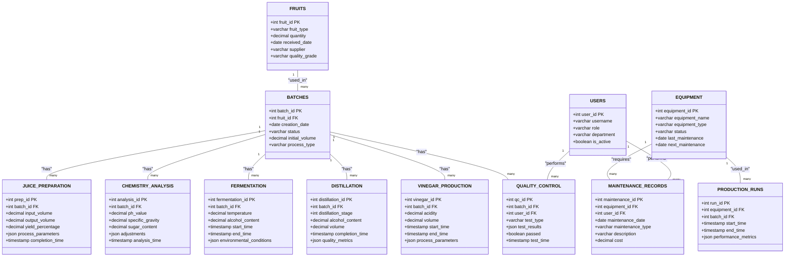

# Xoohoox ERP System Diagram

## Process Flow Diagram

## Swimlane Diagram

## Departmental View Explanation

1. **Procurement Department** (Pink)
   - Handles all raw material acquisition
   - Manages initial quality checks
   - Controls inventory levels

2. **Production Department** (Blue)
   - Manages the core production process
   - Handles all transformation stages
   - Coordinates with quality department

3. **Quality Department** (Yellow)
   - Conducts testing at various stages
   - Makes critical process decisions
   - Ensures product standards

4. **Processing Department** (Green)
   - Handles final product processing
   - Manages both distillation and vinegar paths
   - Works closely with quality control

5. **Maintenance Department** (Cyan)
   - Monitors equipment health
   - Schedules maintenance
   - Tracks performance metrics

6. **Administration** (Pink)
   - Generates reports
   - Performs analytics
   - Maintains documentation

## Key Interactions
- Dotted lines (.-.) show support processes
- Solid lines (--) show main process flow
- Quality department makes the critical ABV decision
- Maintenance supports all production processes
- Administration receives data from all departments 

## Traditional RDBMS Diagram

## Table Relationships Explanation

1. **Core Production Tables**
   - `FRUITS` to `BATCHES`: One-to-many (one fruit type can be used in many batches)
   - `BATCHES` to process tables: One-to-many (one batch can have multiple process steps)

2. **Process Tables**
   - `JUICE_PREPARATION`: Tracks initial processing
   - `CHEMISTRY_ANALYSIS`: Records chemical properties
   - `FERMENTATION`: Tracks fermentation process
   - `DISTILLATION`: Records distillation stages
   - `VINEGAR_PRODUCTION`: Tracks vinegar making process

3. **Quality and Equipment**
   - `QUALITY_CONTROL`: Links batches to users and test results
   - `EQUIPMENT`: Tracks all production equipment
   - `MAINTENANCE_RECORDS`: Links equipment to maintenance history
   - `PRODUCTION_RUNS`: Tracks equipment usage

4. **User Management**
   - `USERS`: Manages system users and their roles
   - Links to quality control and maintenance records

## Key Features
- Primary Keys (PK) for all tables
- Foreign Keys (FK) for relationships
- Timestamps for process tracking
- JSON fields for flexible data storage
- Decimal precision for measurements
- Status tracking for batches and equipment 