```mermaid
graph TD
    subgraph Backend["Backend Status"]
        B1[Core Infrastructure] --> B1a[✅ Database Models]
        B1 --> B1b[✅ API Endpoints]
        B1 --> B1c[✅ Logging System]
        B1 --> B1d[✅ Docker Config]
        B1 --> B1e[✅ Test Coverage]
        
        B2[Current Issues] --> B2a[⚠️ Package.json Config]
        B2 --> B2b[⚠️ Dev Server Issues]
        B2 --> B2c[⚠️ Pending API Endpoints]
        
        B3[Completed Features] --> B3a[✅ Batch Management API]
        B3 --> B3b[✅ Quality Control API]
        B3 --> B3c[✅ Equipment Maintenance API]
        B3 --> B3d[✅ Authentication API]
        B3 --> B3e[✅ Database Migrations]
        B3 --> B3f[✅ Data Validation]
    end

    subgraph Frontend["Frontend Status"]
        F1[Core Infrastructure] --> F1a[✅ Vite Project Structure]
        F1 --> F1b[✅ Material-UI v7]
        F1 --> F1c[✅ TypeScript Config]
        F1 --> F1d[✅ Basic Routing]
        
        F2[Current Implementation] --> F2a[✅ Layout Components]
        F2 --> F2b[✅ BatchManagement]
        F2 --> F2c[✅ Form Handling]
        F2 --> F2d[✅ DatePicker]
        F2 --> F2e[✅ Responsive Layout]
        
        F3[Pending Features] --> F3a[⚠️ Complete UI Components]
        F3 --> F3b[⚠️ API Integration]
        F3 --> F3c[⚠️ Form Validation]
        F3 --> F3d[⚠️ Edit/Delete Functionality]
        F3 --> F3e[⚠️ Real-time Updates]
    end

    subgraph NextSteps["Next Steps"]
        NS1[Backend Priority] --> NS1a[Fix Package.json]
        NS1 --> NS1b[Fix Dev Server]
        NS1 --> NS1c[Complete APIs]
        NS1 --> NS1d[Validation Logic]
        
        NS2[Frontend Priority] --> NS2a[Complete UI]
        NS2 --> NS2b[API Integration]
        NS2 --> NS2c[Form Validation]
        NS2 --> NS2d[Edit/Delete]
        NS2 --> NS2e[Real-time Updates]
        
        NS3[Integration] --> NS3a[Connect Frontend/Backend]
        NS3 --> NS3b[WebSocket Setup]
        NS3 --> NS3c[Error Handling]
        NS3 --> NS3d[Auth Flow]
    end

    style Backend fill:#f9f,stroke:#333,stroke-width:2px
    style Frontend fill:#bbf,stroke:#333,stroke-width:2px
    style NextSteps fill:#bfb,stroke:#333,stroke-width:2px
```

# Project Progress Report

## Current System State (Updated April 12, 2024)
- Frontend development progressing with Material-UI v7 implementation
- Backend API implementation complete but package.json issue needs resolution
- Database models and migrations in place
- Logging system implemented with rotation
- Project organization improved

## Implementation Progress

### Completed Features
1. Frontend Development (Latest)
   - Project structure created with Vite v6.2.6
   - Material-UI v7.0.2 integration
   - BatchManagement component implemented
   - Form handling with proper TypeScript types
   - DatePicker integration with proper type annotations
   - Responsive layout using Box components
   - Development server running at http://localhost:5173/

2. Backend API Implementation
   - Batch Management API
   - Quality Control API
   - Equipment Maintenance API
   - Authentication API
   - Comprehensive test coverage
   - API documentation

3. Database Layer
   - All required models implemented
   - Migrations in place
   - PostgreSQL and SQLite support
   - Data validation

4. Logging System
   - Centralized logging configuration
   - Component-specific loggers
   - Log rotation (10MB files, 5 backups)
   - Request/response logging
   - Error handling and logging

### Current Issues
1. Backend Package Configuration
   - Missing package.json in xoohoox-backend directory
   - Need to resolve npm configuration for backend
   - Backend development server not starting

2. Frontend Development
   - Need to implement remaining UI components
   - API integration pending backend resolution
   - Error handling for form inputs needed
   - Edit and delete functionality pending

### Next Steps
1. Backend Configuration
   - Create and configure package.json for backend
   - Set up proper npm scripts
   - Resolve development server issues

2. Frontend Development
   - Complete remaining UI components
   - Implement API integration
   - Add form validation and error handling
   - Implement edit and delete functionality

3. Testing and Documentation
   - Update API documentation
   - Add frontend component tests
   - Document UI/UX patterns
   - Create user guides

## Testing Coverage

### API Tests
1. Batch Management
   - CRUD operations
   - Validation rules
   - Error handling
   - Status transitions

2. Quality Control
   - Test recording
   - Parameter validation
   - Result tracking
   - Corrective actions

3. Equipment Maintenance
   - Maintenance scheduling
   - Status updates
   - Parts tracking
   - Cost recording

4. Authentication
   - Login/logout
   - Token management
   - User creation
   - Authorization checks

### Integration Tests
1. Complete Workflows
   - Batch creation → Quality check → Maintenance
   - Equipment maintenance → Batch tracking
   - Quality control → Batch status updates

2. Data Consistency
   - Cross-reference validation
   - Status synchronization
   - Data integrity checks

## Next Actions
1. Frontend Development
   - Implement authentication flow
   - Create main layout
   - Build batch management interface
   - Add quality control screens
   - Create equipment maintenance dashboard

2. Frontend Testing
   - Component tests
   - Integration tests
   - E2E testing
   - Performance testing

3. Documentation
   - Frontend development guide
   - Deployment instructions
   - User guides

4. Deployment
   - Environment setup
   - CI/CD configuration
   - Monitoring setup

## Technical Details
### Backend
- Python 3.11+
- FastAPI
- SQLAlchemy
- PostgreSQL/SQLite
- pytest
- Logging with rotation

### Frontend
- React 18
- TypeScript
- Material-UI
- Redux Toolkit
- React Query
- Vitest

# Xoohoox Fermentation & Distillation Management System - Progress Report

## Current System State

### Database Models
The system has been structured with a comprehensive set of models to track the entire fruit transformation process:

1. **TransformationStage**
   - Core model that tracks each stage of the transformation process
   - Supports branching logic for different paths (e.g., vinegar path)
   - Tracks trial counts and selection criteria
   - Manages upscaling relationships between stages

2. **JuicingResults**
   - Tracks raw input preparation variants (JP1-JP5)
   - Records input/output measurements
   - Captures process parameters and yields
   - Supports raw juice ferment rules

3. **ChemistryResults**
   - Manages chemistry adjustments and corrections
   - Tracks pH and specific gravity readings
   - Supports scale-up calculations
   - Enforces raw juice ferment rules

4. **HeatActivationResults**
   - Controls temperature and rest times
   - Manages nutrient and yeast preparation
   - Tracks pitch conditions

5. **FermentationResults**
   - Comprehensive fermentation tracking
   - Supports multiple trial management
   - Tracks timing and environmental factors
   - Manages upscaling relationships

6. **VinegarResults**
   - Dedicated vinegar processing path
   - Tracks acidity and compound analysis
   - Manages timing and completion criteria

7. **DistillationResults**
   - Expanded compound analysis
   - Quality test tracking
   - Environmental reporting
   - Sample retention management

8. **Stage2Results**
   - Post-test analysis
   - Decision criteria tracking
   - Comprehensive compound analysis

9. **FruitPerformance**
   - Fruit quality metrics
   - Yield calculations
   - Sensory evaluation

### Pydantic Schemas
All models have corresponding Pydantic schemas with:
- Base schemas for common fields
- Create schemas for new entries
- Update schemas for modifications
- Full schemas with ID and timestamps
- Combined schemas for nested relationships

## Implementation Progress

### Completed
1. ✅ Database model structure
2. ✅ Pydantic schema definitions
3. ✅ Decimal precision for measurements
4. ✅ Unit standardization (milliliters)
5. ✅ Trial management system
6. ✅ Upscaling support
7. ✅ Vinegar path branching
8. ✅ Compound analysis expansion
9. ✅ Backend port management system
   - Automatic port conflict detection
   - Dynamic port allocation
   - Process management through start_server.py

### In Progress
1. 🔄 API endpoint implementation
2. 🔄 Validation logic for branching rules
3. 🔄 Process variant validation
4. 🔄 Trial selection criteria
5. 🔄 Upscaling ratio validation
6. 🔄 Frontend port management implementation

### Planned Next Steps
1. 📋 Create API endpoints for:
   - Stage management
   - Trial tracking
   - Results recording
   - Process branching
   - Upscaling management

2. 📋 Implement validation logic for:
   - ABV rules (8-13% for vinegar path)
   - Raw input preparation variants
   - Trial selection criteria
   - Upscaling ratios
   - Compound analysis thresholds

3. 📋 Add business logic for:
   - Trial selection
   - Process branching
   - Upscaling calculations
   - Compound analysis interpretation

4. 📋 Develop reporting for:
   - Fruit performance
   - Trial outcomes
   - Process efficiency
   - Environmental impact

## Technical Details

### Data Types
- All measurements use `Numeric` with appropriate precision
- Volumes in milliliters with 2 decimal places
- Percentages with 2 decimal places
- Temperatures in Celsius with 2 decimal places
- pH values with 2 decimal places
- Compound analysis in mg/L with 2 decimal places

### Relationships
- Stages can have multiple trials
- Trials can have multiple upscales
- Stages can branch to different paths
- Results are linked to specific stages
- Upscales maintain parent-child relationships

### Validation Rules
- ABV must be 8-13% for vinegar path
- Raw juice ferments (JP1) have special rules
- Trial selection requires minimum criteria
- Upscaling ratios have maximum limits
- Compound analysis has threshold requirements

### System Infrastructure
- Backend server uses dynamic port allocation (8000+)
- Automatic port conflict resolution
- Process management through dedicated scripts
- Frontend port management (planned)

## System Scope
This system manages the full lifecycle of fruit transformation, including:
- Raw input preparation (juice/peel/pulp)
- Chemistry correction
- Fermentation tracking
- Alcohol distillation (multiple stages)
- Vinegar production branching
- Compound testing and yield tracking

## Next Actions
1. Implement frontend port management
2. Implement API endpoints
3. Add validation logic
4. Create business rules
5. Develop reporting system
6. Add authentication
7. Create frontend interface
8. Implement rate limiting
9. Add testing suite

